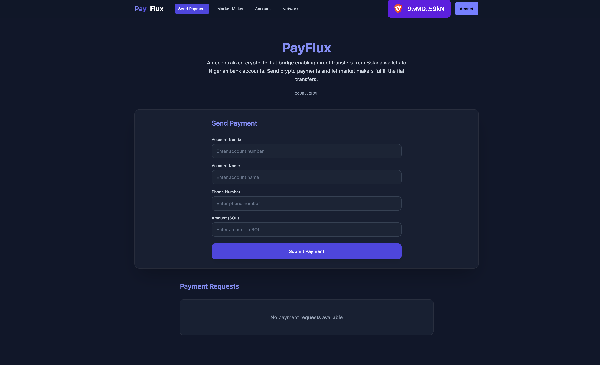

# PayFlux: A Crypto-to-Fiat Bridge



PayFlux is a decentralized application (dApp) that enables seamless conversion of cryptocurrency to fiat currency, built on the Solana blockchain and powered by Quicknode's infrastructure.

## Core Flows

### Sender Flow
1. Connect wallet (via Quicknode RPC)
2. Enter recipient bank details:
   - Account number
   - Account holder name
   - Phone number
3. Enter NGN amount
4. Submit transaction (funds locked in PDA)

### Market Maker Flow
1. View pending requests list (real-time updates via Quicknode Streams)
2. Select request to fulfill
3. Connect wallet
4. Execute fulfillment transaction
5. Make bank transfer

### Receiver Flow
1. Get SMS notification (triggered by Quicknode event)
2. Verify with NIN
3. Receive bank transfer
4. Get confirmation SMS with USSD code
5. Confirm receipt

## Technical Implementation

### Smart Contract Structure

```rust
pub struct PaymentRequest {
    pub sender: Pubkey,
    pub amount: u64,
    pub status: PaymentStatus,
    pub market_maker: Option<Pubkey>,
    pub recipient_details: RecipientDetails,
    pub bump: u8,
    pub request_id: String,
}

pub struct RecipientDetails {
    pub account_number: String,  // max_len = 10
    pub account_name: String,    // max_len = 100
    pub phone_number: String,    // max_len = 15
}

pub enum PaymentStatus {
    Pending,
    Completed
}
```

### Database Schema

```sql
CREATE TABLE transactions (
  request_id TEXT PRIMARY KEY,
  sender_wallet TEXT,
  receiver_account TEXT,
  receiver_name TEXT,
  receiver_phone TEXT,
  amount_ngn DECIMAL,
  market_maker_wallet TEXT NULL,
  status TEXT,
  created_at TIMESTAMP,
  nin_verified BOOLEAN DEFAULT FALSE,
  ussd_code TEXT NULL,
  receipt_confirmed BOOLEAN DEFAULT FALSE
);

-- Indexes for performance
CREATE INDEX idx_status ON transactions(status);
CREATE INDEX idx_sender_wallet ON transactions(sender_wallet);
CREATE INDEX idx_market_maker_wallet ON transactions(market_maker_wallet);
```

## Technical Architecture

### Smart Contract (Anchor Program)
- Written in Rust using the Anchor framework
- Handles payment request creation and fulfillment
- Manages market maker interactions
- Instruction discriminators:
  - `create_payment`: `[28, 81, 85, 253, 7, 223, 154, 42]`
  - `fulfill_payment`: `[91, 23, 244, 253, 211, 9, 32, 27]`

### Backend API (Express)
- RESTful API for transaction management
- SQLite database for transaction history
- SMS notifications for payment status updates
- Webhook endpoint for Quicknode Streams

### Quicknode Integration
Our application leverages Quicknode's infrastructure for real-time transaction monitoring and processing:

#### Quicknode Streams Configuration
The following filter is used in the Quicknode dashboard to process relevant transactions:

```javascript
// Constants
const BASE58_ALPHABET = '123456789ABCDEFGHJKLMNPQRSTUVWXYZabcdefghijkmnopqrstuvwxyz';
const PAYFLUX_PROGRAM_ID = process.env.PROGRAM_ID;
const CREATE_PAYMENT_DISCRIMINATOR = [28, 81, 85, 253, 7, 223, 154, 42];
const FULFILL_PAYMENT_DISCRIMINATOR = [91, 23, 244, 253, 211, 9, 32, 27];

const FILTER_CONFIG = {
    programIds: [PAYFLUX_PROGRAM_ID],
    skipFailed: true,
    instructionDiscriminators: [
        CREATE_PAYMENT_DISCRIMINATOR,
        FULFILL_PAYMENT_DISCRIMINATOR
    ]
};

// Main filter function
function main(stream) {
    try {
        const data = stream[0];
        if (!data?.transactions?.length) {
            return { error: 'Invalid or missing stream' };
        }

        const matchedTransactions = data.transactions
            .filter(matchesFilter)
            .map(tx => formatTransaction(tx, data));

        if (matchedTransactions.length === 0) {
            return null;
        }        
        return { matchedTransactions };
    } catch (error) {
        console.error('Error in main function:', error);
        return { error: error.message, stack: error.stack };
    }
}
```

The Stream processes transactions and sends webhooks to our backend with the following payload format:
```json
{
  "matchedTransactions": [
    {
      "signature": "string",
      "blockTime": number,
      "instruction": "create_payment" | "fulfill_payment",
      "accounts": {
        "sender": "string",
        "recipient": "string",
        "marketMaker": "string"
      }
    }
  ]
}
```

### Frontend (Next.js)
- Modern UI built with Next.js and TailwindCSS
- Wallet integration using @solana/wallet-adapter
- Real-time transaction status updates

## Project Structure

```
PayFlux/
├── anchor/                     # Solana program (smart contract)
│   ├── programs/              # Program source code
│   │   └── PayFlux/
│   │       └── src/
│   │           └── lib.rs     # Smart contract implementation
│   ├── tests/                 # Program tests
│   └── migrations/            # Deployment scripts
├── backend/                   # Express.js Backend API
│   ├── src/
│   │   ├── controllers/       # API route handlers
│   │   ├── services/          # Business logic
│   │   ├── models/           # Database models
│   │   ├── quicknode/        # Quicknode integration
│   │   │   └── streams.ts    # Stream handlers
│   │   └── utils/            # Helper functions
│   ├── prisma/               # Database schema and migrations
│   └── tests/                # API tests
├── src/                      # Frontend (Next.js)
│   ├── app/                  # Next.js app router
│   │   ├── PayFlux/         # Payment features
│   │   ├── account/         # Wallet management
│   │   ├── clusters/        # Network selection
│   │   └── api/             # API routes
│   └── components/          # React components
│       ├── PayFlux/        # Payment components
│       ├── account/        # Account components
│       ├── cluster/        # Network components
│       ├── dashboard/      # Dashboard UI
│       ├── solana/         # Wallet integration
│       └── ui/             # Shared UI components
└── public/                  # Static assets
```

## Getting Started

### Prerequisites
- Node.js 18+
- Rust and Solana CLI tools
- SQLite

### Installation

1. Clone the repository:
```bash
git clone https://github.com/yourusername/payflux.git
cd payflux
```

2. Install dependencies:
```bash
# Install frontend dependencies
pnpm install

# Install backend dependencies
cd backend
pnpm install

# Install Anchor dependencies
cd ../anchor
pnpm install
```

3. Set up environment variables:
```bash
# Backend
cp backend/.env.example backend/.env

# Frontend
cp .env.example .env
```

4. Build and deploy the Anchor program:
```bash
cd anchor
anchor build
anchor deploy
```

5. Start the development servers:
```bash
# Start the backend server
cd backend
pnpm dev

# Start the frontend server
cd ..
pnpm dev
```

## API Documentation

### Transaction Endpoints

#### GET /api/transactions
List all transactions

#### GET /api/transactions/:requestId
Get transaction details

#### POST /api/transactions/:requestId/verify-nin
Verify NIN for a transaction

#### POST /api/transactions/:requestId/confirm-receipt
Confirm receipt of payment

### Notification Endpoints

#### POST /api/notifications/test
Send test notification

#### POST /api/notifications/resend/:requestId
Resend transaction notification

### Webhook Endpoint

#### POST /webhook
Receives transaction events from Quicknode Streams

## Contributing
Please read [CONTRIBUTING.md](CONTRIBUTING.md) for details on our code of conduct and the process for submitting pull requests.

## License
This project is licensed under the MIT License - see the [LICENSE](LICENSE) file for details.
